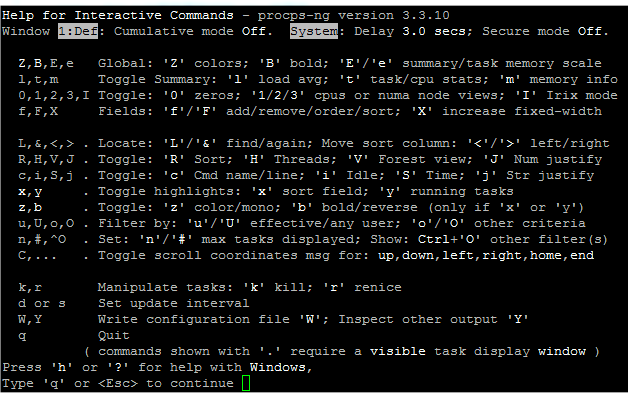
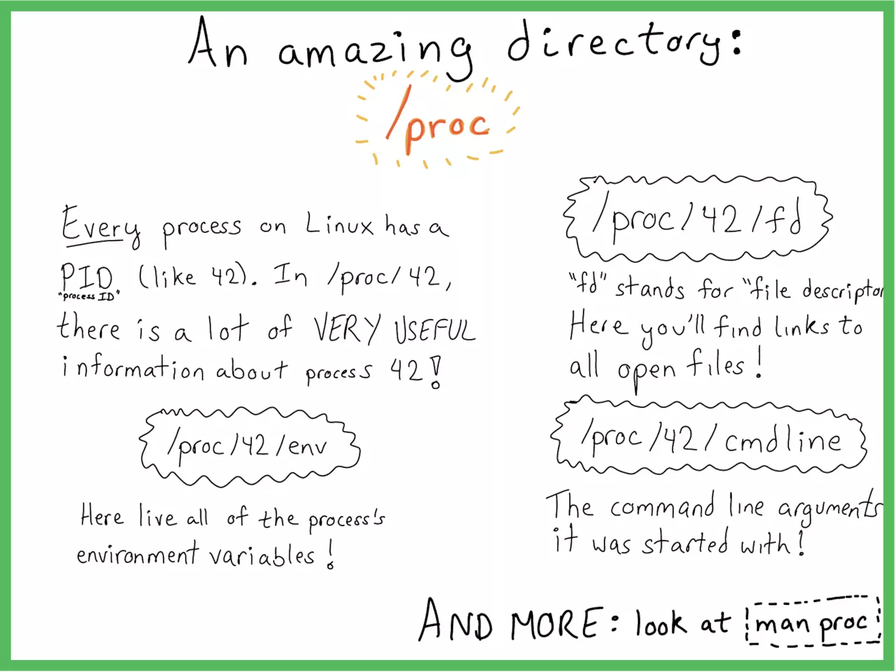

# linux内核架构及管理

## 目录结构

## [内存管理](https://www.kernel.org/doc/html/latest/admin-guide/mm/index.html)

> # Memory Management
>
> Linux memory management subsystem is responsible, as the name implies, for managing the memory in the system. This includes implemnetation of virtual memory and demand paging, memory allocation both for kernel internal structures and user space programms, mapping of files into processes address space and many other cool things.
>
> Linux memory management is a complex system with many configurable settings. Most of these settings are available via `/proc` filesystem and can be quired and adjusted using `sysctl`. These APIs are described in Documentation/admin-guide/sysctl/vm.rst and in [man 5 proc](http://man7.org/linux/man-pages/man5/proc.5.html).
>
> Linux memory management has its own jargon and if you are not yet familiar with it, consider reading [Documentation/admin-guide/mm/concepts.rst](https://www.kernel.org/doc/html/latest/admin-guide/mm/concepts.html#mm-concepts).

linux内存管理子系统，正如名字所言，是用于管理系统中的内存的。这包括实现虚拟内存(vistual memory)和“按需调页”(demand―paging),内存加载（包括内核中内部结构以及用户空间程序），映射文件到进程地址空间等

linux内存管理系统是一个复杂的系统，有着许多可配置的设置。大部分设置可以通过`/proc`文件夹查看，并且可以通过`sysctl`调整，这些Api都在`Documentation/admin-guide/sysctl/vm.rst`中有描述，或者使用`man 5 proc ` 命令查询

linux内存管理 系统有自己的术语，如果你还不熟悉，可以考虑阅读[Documentation/admin-guide/mm/concepts.rst](https://www.kernel.org/doc/html/latest/admin-guide/mm/concepts.html#mm-concepts).

### 概念总述

> The memory management in Linux is a complex system that evolved over the years and included more and more functionality to support a variety of systems from MMU-less microcontrollers to supercomputers. The memory management for systems without an MMU is called `nommu` and it definitely deserves a dedicated document, which hopefully will be eventually written. Yet, although some of the concepts are the same, here we assume that an MMU is available and a CPU can translate a virtual address to a physical address.

Linux内存管理是一个复杂的系统，并且随着时间的推移，提供来了越来越多的功能支持从无MMU(memory manager unit)内存管理单元的微控制器到超级计算机的各种各样的系统。没有MMU的系统成为`nommu`并且它绝对值得一个专门的文档。但是，尽管很多概念一样，这里我们假设我们的设备提供了MMU并且CPU能转译一个虚拟地址到物理地址

> Virtual Memory Primer
> Huge Pages（大页）
> Zones
> Nodes
> Page cache（页高速缓存）
> Anonymous Memory
> Reclaim
> Compaction
> OOM killer

###  Virtual Memory Primer

> he physical memory in a computer system is a limited resource and even for systems that support memory hotplug there is a hard limit on the amount of memory that can be installed. The physical memory is not necessarily contiguous; it might be accessible as a set of distinct address ranges. Besides, different CPU architectures, and even different implementations of the same architecture have different views of how these address ranges are defined.
>
> All this makes dealing directly with physical memory quite complex and to avoid this complexity a concept of virtual memory was developed.
>
> The virtual memory abstracts the details of physical memory from the application software, allows to keep only needed information in the physical memory (demand paging) and provides a mechanism for the protection and controlled sharing of data between processes.
>
> With virtual memory, each and every memory access uses a virtual address. When the CPU decodes the an instruction that reads (or writes) from (or to) the system memory, it translates the virtual address encoded in that instruction to a physical address that the memory controller can understand.
>
> The physical system memory is divided into page frames, or pages. The size of each page is architecture specific. Some architectures allow selection of the page size from several supported values; this selection is performed at the kernel build time by setting an appropriate kernel configuration option.
>
> Each physical memory page can be mapped as one or more virtual pages. These mappings are described by page tables that allow translation from a virtual address used by programs to the physical memory address. The page tables are organized hierarchically.
>
> The tables at the lowest level of the hierarchy contain physical addresses of actual pages used by the software. The tables at higher levels contain physical addresses of the pages belonging to the lower levels. The pointer to the top level page table resides in a register. When the CPU performs the address translation, it uses this register to access the top level page table. The high bits of the virtual address are used to index an entry in the top level page table. That entry is then used to access the next level in the hierarchy with the next bits of the virtual address as the index to that level page table. The lowest bits in the virtual address define the offset inside the actual page. 

计算机系统中物理内存是一个有限的资源，即使对于那些支持热插拔的系统在可以安装的内存数量上也存在硬性限制。物理内存是没有必要连续的，他可以通过一系列的不同的地址范围访问。除此之外，不同的CPU架构，甚至相同CPU架构的不同实现对于内存地址定义都有不同的做法。

这些导致直接处理物理内存十分复杂，为了避免这些复杂性，开发了一个**虚拟内存（virtual memory）**的概念

虚拟内存从应用程序中抽象出物理内存的细节，允许只有必须的信息才保留在**物理内存中（demand paging按需分页）**，提供一种保护机制以及控制进程之间共享数据。

有了虚拟内存，每个内存访问都要使用虚拟地址。当CPU解码一个从系统内存中读取（写入）的指令，它将转译虚拟地址为内存控制器（memory controller）能理解的物理地址。

物理系统内存被分隔为**page frame（页帧）**或者 **页（pages）**。页的大小取决于特定的架构。一些架构允许从几个支持的值中选取为页的大小，这种选择是在内存构建时通过恰当的内存配置选项设置的。

每个物理内存页能够被映射到一个或多个虚拟页。这种映射通过**页表（page table）**描述。它允许通过程序转换一个虚拟地址到一个物理内存地址。页表是有层级关系的。

在层级最底层的页表包含了软件使用的真**实页（actual page）**的物理地址。在更高层级的页表包含了底层级的**页（page）**的物理地址。指针指向最高层级的页表保存在**寄存器中（register）**。当一个cpu指向地址转译，它使用这个寄存器取访问最高级别的页表。虚拟 地址的高位被用于索引最高层级页表的入口，下一段字节（next bits）用于进入下一个层级的页表，虚拟地址的最低位定义了真实页的偏移量（offset）

> LINUX内核使用了“多层调页（multi-level paging）技术”来达到这一目的。这里的多级指的是;PGD(Page Global Directory,页总目录） + PMD（页中目录）+PTE（页表索引）+ OFFSET(页面内部偏移).

### [Huge Pages](https://www.kernel.org/doc/html/latest/admin-guide/mm/concepts.html#id2)

> The address translation requires several memory accesses and memory accesses are slow relatively to CPU speed. To avoid spending precious processor cycles on the address translation, CPUs maintain a cache of such translations called Translation Lookaside Buffer (or TLB). Usually TLB is pretty scarce resource and applications with large memory working set will experience performance hit because of TLB misses.
>
> Many modern CPU architectures allow mapping of the memory pages directly by the higher levels in the page table. For instance, on x86, it is possible to map 2M and even 1G pages using entries in the second and the third level page tables. In Linux such pages are called huge. Usage of huge pages significantly reduces pressure on TLB, improves TLB hit-rate and thus improves overall system performance.
>
> There are two mechanisms in Linux that enable mapping of the physical memory with the huge pages. The first one is HugeTLB filesystem, or hugetlbfs. It is a pseudo filesystem that uses RAM as its backing store. For the files created in this filesystem the data resides in the memory and mapped using huge pages. The hugetlbfs is described at [Documentation/admin-guide/mm/hugetlbpage.rst](https://www.kernel.org/doc/html/latest/admin-guide/mm/hugetlbpage.html#hugetlbpage).
>
> Another, more recent, mechanism that enables use of the huge pages is called Transparent HugePages, or THP. Unlike the hugetlbfs that requires users and/or system administrators to configure what parts of the system memory should and can be mapped by the huge pages, THP manages such mappings transparently to the user and hence the name. See [Documentation/admin-guide/mm/transhuge.rst](https://www.kernel.org/doc/html/latest/admin-guide/mm/transhuge.html#admin-guide-transhuge) for more details about THP.

地址转换需要访问几次内存，并且访问内存是慢于CPU速度的。为了避免在转换地址上花费昂贵的处理器周期，CPU维护一个这些地址转换的缓存，称之为Translation LookAside Buffer（旁路转换缓冲,或称为页表缓冲），通常TLB是十分稀有的资源，需要大内存工作的应用程序由于缺少TLB，其性能将受到冲击。

很多现代化的CPU架构允许通过高层级的 **页表** 直接映射内存页。比如，在X86，有可能使用第二或者第三层级的页表映射2M甚至1G的page页。在linux中，这些页称为huge。使用**huge page（大页）**减少了TLB的压力，提高了TLB冲击的命中率，也因此提高了整个系统的性能。

在Linux中，有两种机制能够映射物理内存到Huge pages(大页)。第一种是HugeTLB文件系统，或称为HugeTLBfs。这是一个伪文件系统，使用RAM作为底层存储。对于那些在这个 文件 系统中创建的文件来说，数据保留在内存中，并使用huge page(大表)映射。

另一种机制称为Transparent HugePages 或者THP。不同于hugetlbfs需要用户或系统管理员来配置那部分的系统内存应该被huge page所映射，THP通过对用户透明的方式来管理映射。

### [Zones](https://www.kernel.org/doc/html/latest/admin-guide/mm/concepts.html#id3)

> Often hardware poses restrictions on how different physical memory ranges can be accessed. In some cases, devices cannot perform DMA to all the addressable memory. In other cases, the size of the physical memory exceeds the maximal addressable size of virtual memory and special actions are required to access portions of the memory. Linux groups memory pages into zones according to their possible usage. For example, ZONE_DMA will contain memory that can be used by devices for DMA, ZONE_HIGHMEM will contain memory that is not permanently mapped into kernel’s address space and ZONE_NORMAL will contain normally addressed pages.
>
> The actual layout of the memory zones is hardware dependent as not all architectures define all zones, and requirements for DMA are different for different platforms.

通常硬件限制了多大的物理内存范围能被访问。在这种情况，设备不能执行DMA在所有可寻址的内存上。另一种情况，物理内存的大小超过了虚拟内存的最大可寻址值，需要特殊的操作来访问某部分内存。linux根据它们可能的使用情况进行分组。比如，ZONE_DMA将包含被DMA设备所使用的内存，ZONE_HIGHMEN将包含不是永久映射到  内核地址控制的内存，ZONE_NORMAL将包含正常的地址页（addressed pages）

内存空间的真实布局是取决于硬件的，因为并不是所有的架构都定义了所有空间，并且每个平台对DMA的要求都不一样的。

### [Nodes](https://www.kernel.org/doc/html/latest/admin-guide/mm/concepts.html#id4)

> Many multi-processor machines are NUMA - Non-Uniform Memory Access - systems. In such systems the memory is arranged into banks that have different access latency depending on the “distance” from the processor. Each bank is referred to as a node and for each node Linux constructs an independent memory management subsystem. A node has its own set of zones, lists of free and used pages and various statistics counters. You can find more details about NUMA in [Documentation/vm/numa.rst](https://www.kernel.org/doc/html/latest/vm/numa.html#numa) and in [Documentation/admin-guide/mm/numa_memory_policy.rst](https://www.kernel.org/doc/html/latest/admin-guide/mm/numa_memory_policy.html#numa-memory-policy).

多核处理器的设备都是NUMA(Non-Uniform-Menory-Access)非统一内存访问系统。在这样的系统，内存都被排成队列（banks）,这样由于与处理器的距离不同就会造成不同的访问延迟。每个队列可被认为是一个节点，linux为每个节点构建一个独立的内存管理子系统。一个节点有自己的空间集，使用与未使用的页的列表，各种静态计数。

### [Page cache](https://www.kernel.org/doc/html/latest/admin-guide/mm/concepts.html#id5) 页高速缓存

> The physical memory is volatile and the common case for getting data into the memory is to read it from files. Whenever a file is read, the data is put into the page cache to avoid expensive disk access on the subsequent reads. Similarly, when one writes to a file, the data is placed in the page cache and eventually gets into the backing storage device. The written pages are marked as dirty and when Linux decides to reuse them for other purposes, it makes sure to synchronize the file contents on the device with the updated data.

各种物理内存都是易变的（volatile），往内存写数据最普通的列子就是读取文件的数据。一旦文件被读取，数据被加载在page cache（页高速缓存）以避免在后续的读取中再次花费昂贵的硬盘访问。类似的，当写数据到文件时，数据将放在page cache并最终写入到存储设备。已写的page被标记为脏，当linux决定重新使用这些page时，它会确保使用更新的数据同步到文件中。

### [Anonymous Memory](https://www.kernel.org/doc/html/latest/admin-guide/mm/concepts.html#id6) 匿名内存

> The anonymous memory or anonymous mappings represent memory that is not backed by a filesystem. Such mappings are implicitly created for program’s stack and heap or by explicit calls to mmap(2) system call. Usually, the anonymous mappings only define virtual memory areas that the program is allowed to access. The read accesses will result in creation of a page table entry that references a special physical page filled with zeroes. When the program performs a write, a regular physical page will be allocated to hold the written data. The page will be marked dirty and if the kernel decides to repurpose it, the dirty page will be swapped out.

匿名内存或者匿名映射代表这部分内存没有被文件系统返回。这些映射是通过显示调用mmap(2)系统调用为应用程序的栈或堆所创建的。通常，匿名映射只定义虚拟内存区域（程序允许访问的区域）。读 访问会导致创建一个页表条目，该条目指向一个被0填充的特殊页。当程序执行写操作，一个规则的物理page将被分配来填充被写入的数据。页会被标记为脏，如果内核决定要重新使用它，这些dirty page（脏页）会被换出（swap out）

### [Reclaim](https://www.kernel.org/doc/html/latest/admin-guide/mm/concepts.html#id7) 回收

> Throughout the system lifetime, a physical page can be used for storing different types of data. It can be kernel internal data structures, DMA’able buffers for device drivers use, data read from a filesystem, memory allocated by user space processes etc.
>
> Depending on the page usage it is treated differently by the Linux memory management. The pages that can be freed at any time, either because they cache the data available elsewhere, for instance, on a hard disk, or because they can be swapped out, again, to the hard disk, are called reclaimable. The most notable categories of the reclaimable pages are page cache and anonymous memory.
>
> In most cases, the pages holding internal kernel data and used as DMA buffers cannot be repurposed, and they remain pinned until freed by their user. Such pages are called unreclaimable. However, in certain circumstances, even pages occupied with kernel data structures can be reclaimed. For instance, in-memory caches of filesystem metadata can be re-read from the storage device and therefore it is possible to discard them from the main memory when system is under memory pressure.
>
> The process of freeing the reclaimable physical memory pages and repurposing them is called (surprise!) reclaim. Linux can reclaim pages either asynchronously or synchronously, depending on the state of the system. When the system is not loaded, most of the memory is free and allocation requests will be satisfied immediately from the free pages supply. As the load increases, the amount of the free pages goes down and when it reaches a certain threshold (high watermark), an allocation request will awaken the `kswapd` daemon. It will asynchronously scan memory pages and either just free them if the data they contain is available elsewhere, or evict to the backing storage device (remember those dirty pages?). As memory usage increases even more and reaches another threshold - min watermark - an allocation will trigger direct reclaim. In this case allocation is stalled until enough memory pages are reclaimed to satisfy the request.

在整个系统生命周期中，可以使用物理页面存储不同类型的数据。它可以是内核内部的数据结构，为设备驱动程序使用的DMA 缓冲区，从文件系统读取的数据，由用户空间进程分配的内存等等。

### [Compaction](https://www.kernel.org/doc/html/latest/admin-guide/mm/concepts.html#id8) 压缩

> As the system runs, tasks allocate and free the memory and it becomes fragmented. Although with virtual memory it is possible to present scattered physical pages as virtually contiguous range, sometimes it is necessary to allocate large physically contiguous memory areas. Such need may arise, for instance, when a device driver requires a large buffer for DMA, or when THP allocates a huge page. Memory compaction addresses the fragmentation issue. This mechanism moves occupied pages from the lower part of a memory zone to free pages in the upper part of the zone. When a compaction scan is finished free pages are grouped together at the beginning of the zone and allocations of large physically contiguous areas become possible.
>
> Like reclaim, the compaction may happen asynchronously in the `kcompactd` daemon or synchronously as a result of a memory allocation request.

### [OOM killer](https://www.kernel.org/doc/html/latest/admin-guide/mm/concepts.html#id9)

### 资料

1. [Linux分页机制之概述--Linux内存管理(六)](https://blog.csdn.net/gatieme/article/details/52402861?utm_medium=distribute.pc_relevant.none-task-blog-BlogCommendFromMachineLearnPai2-1.nonecase&depth_1-utm_source=distribute.pc_relevant.none-task-blog-BlogCommendFromMachineLearnPai2-1.nonecase)
2. [Linux传统Huge Pages与Transparent Huge Pages再次学习总结](https://www.cnblogs.com/kerrycode/p/7760026.html) 

# linux命令

## TOP命令

### 执行top后显示图

### 列表缩写释意

> 最右边的 `COMMAND` 一列报告进程名（启动它们的命令）。在这个例子里，进程名是 `bash`（一个我们正在运行 `top` 的命令解释器）、`flask`（一个 Python 写的 web 框架）和 `top` 自身。
>
> 其它列提供了关于进程的有用信息：
>
> - `PID`：进程 ID，一个用来定位进程的唯一标识符
> - `USER`：运行进程的用户
> - `PR`：任务的优先级
> - `NI`：Nice 值，优先级的一个更好的表现形式
> - `VIRT`：虚拟内存的大小，单位是 KiB（kibibytes）
> - `RES`：常驻内存大小，单位是 KiB（物理内存和虚拟内存的一部分）
> - `SHR`：共享内存大小，单位是 KiB（共享内存和虚拟内存的一部分）
> - `S`：进程状态，一般 **I** 代表空闲，**R** 代表运行，**S** 代表休眠，**Z** 代表僵尸进程，**T** 或 **t** 代表停止（还有其它更少见的选项）
> - `%CPU`：自从上次屏幕更新后的 CPU 使用率
> - `%MEM`：自从上次屏幕更新后的 `RES` 常驻内存使用率
> - `TIME+`：自从程序启动后总的 CPU 使用时间
> - `COMMAND`：启动命令，如之前描述那样
>
> 确切知道 `VIRT`，`RES` 和 `SHR` 值代表什么在日常操作中并不重要。重要的是要知道 `VIRT` 值最高的进程就是内存使用最多的进程。当你在用 `top` 排查为什么你的电脑运行无比卡的时候，那个 `VIRT` 数值最大的进程就是元凶。如果你想要知道共享内存和物理内存的确切意思，请查阅 [top 手册](http://man7.org/linux/man-pages/man1/top.1.html)的 Linux Memory Types 段落。
>
> 是的，我说的是 kibibytes 而不是 kilobytes。通常称为 kilobyte 的 1024 值实际上是 kibibyte。希腊语的 kilo（χίλιοι）意思是一千（例如一千米是 1000 米，一千克是 1000 克）。Kibi 是 kilo 和 binary 的合成词，意思是 1024 字节（或者 210 ）。但是，因为这个词很难说，所以很多人在说 1024 字节的时候会说 kilobyte。`top` 试图在这里使用恰当的术语，所以按它说的理解就好。

### top头部信息说明

第一行包含系统的大致信息：

- `top`：我们正在运行 `top`！你好！`top`！
- `XX:YY:XX`：当前时间，每次屏幕更新的时候更新
- `up`（接下去是 `X day, YY:ZZ`）：系统的 [uptime](https://en.wikipedia.org/wiki/Uptime)，或者自从系统启动后已经过去了多长时间
- `load average`（后跟三个数字）：分别是过去一分钟、五分钟、15 分钟的[系统负载](https://en.wikipedia.org/wiki/Load_(computing))

第二行（`Task`）显示了正在运行的任务的信息，不用解释。它显示了进程总数和正在运行的、休眠中的、停止的进程数和僵尸进程数。这实际上是上述 `S`（状态）列的总和。

第三行（`%Cpu(s)`）显示了按类型划分的 CPU 使用情况。数据是屏幕刷新之间的值。这些值是：

- `us`：用户进程
- `sy`：系统进程
- `ni`：[nice](https://en.wikipedia.org/wiki/Nice_(Unix)#Etymology) 用户进程
- `id`：CPU 的空闲时间，这个值比较高时说明系统比较空闲
- `wa`：等待时间，或者消耗在等待 I/O 完成的时间
- `hi`：消耗在硬件中断的时间
- `si`：消耗在软件中断的时间
- `st`：“虚拟机管理程序从该虚拟机窃取的时间”

你可以通过点击 `t`（toggle）来展开或折叠 `Task` 和 `%Cpu(s)` 行。

第四行（`Kib Mem`）和第五行（`KiB Swap`）提供了内存和交换空间的信息。这些数值是：

- 总内存容量
- 已用内存
- 空闲内存
- 内存的缓冲值
- 交换空间的缓存值

默认它们是用 KiB 为单位展示的，但是按下 `E`（扩展内存缩放 extend memory scaling）可以轮换不同的单位：KiB、MiB、GiB、TiB、PiB、EiB（kilobytes、megabytes、gigabytes、terabytes、petabytes 和 exabytes）

`top` 用户手册有更多选项和配置项信息。你可以运行 `man top` 来查看你系统上的文档。还有很多 [HTML 版的 man 手册](http://man7.org/linux/man-pages/man1/top.1.html)，但是请留意，这些手册可能是针对不同 top 版本的。

### 辅助命令用法

按下 `h` 调用帮助界面，该界面也显示了默认延迟（屏幕更新的时间间隔）。这个值默认（大约）是 3 秒，但你可以输入 `d`（大概是 delay 的意思）或者 `s`（可能是 screen 或 seconds 的意思）来修改它。显示如下

> 按数字1就可以显示每核CPU的使用情况
>
> Z ：高亮
>
> B：加粗
>
> 

### 数据从何而来

那么数据从何而来？ `/proc`目录是一个虚拟目录，存储的是当前内核的一系列特殊文件，你不仅能查看一些状态，甚至能修改一些值来改变系统的行为。

比如top的load （使用uptime命令得到同样的结果）。读取的就是 `/proc/loadavg` 文件 而每核cpu的信息，读取 `/proc/stat`文件

这些命令，是对/proc目录中一系列信息的解析和友好的展示，这些值，Linux内核都算好了躺在那呢。

(图片来源网络) 创建这个目录的人真是天才！
作者：小姐姐味道
链接：https://juejin.im/post/5bf0b52df265da611b57f0e6

### 资料参考

1. [TOP命令使用](https://linux.cn/article-9937-1.html)
2. [top命令在线手册](http://man7.org/linux/man-pages/man1/top.1.html)

# 资料

1. [linux文档,非常重要，整个linux架构原理等](https://www.kernel.org/doc/html/latest/index.html)
2. [linux在线手册](https://linux.die.net/man/)
3. [linux在线手册2](http://man7.org/linux/man-pages/man1/top.1.html)
4. [C 语言常见问题集](http://c-faq-chn.sourceforge.net/ccfaq/index.html)
5. [从苦逼到牛逼，详解Linux运维工程师的打怪升级之路](http://www.yunweipai.com/archives/22629.html)感觉有问题，做个指引吧
6. [linux各种性能报告](http://www.citi.umich.edu/projects/linux-scalability/reports/)